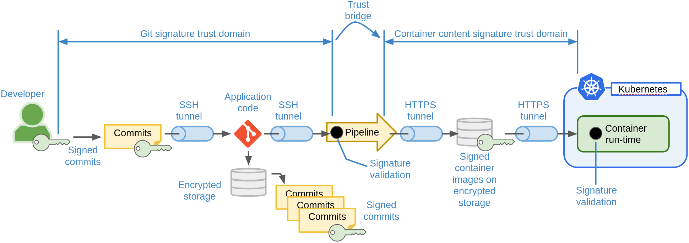
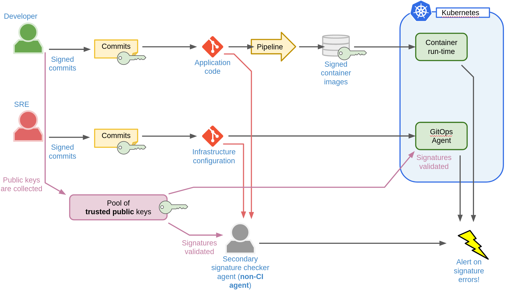

# Git Signature Checker

This repository contain a Git signature checker.

## Introduction - The CIA Triad

When assessing risk, the CIA triad can be used as three corner-stones. The three
elements that make up the CIA triad are:

- **Confidentiality** Protection and secrecy of information. This applies to
    both software algorithms, business processes and potential end-user
    data. Lost secrets may impact competitive business advantages, loss of
    end-user confidence or even legal actions.

- **Integrity** Tamper-protection of our information. This applies to both
    software artifacts and data, including end-user data. Lost integrity may
    result in our software platform being open for hackers and thereby **also
    cause loss of integrity**.

- **Availability** of the service our software provides. This applies both to
    how our infrastructure and applications are designed, but also how it might
    stand-up against e.g. malicious attacks.

Wrt. availability, this could also affect our processes, e.g. are we using sound
DevOps processes that guarantee a short time-to-recover in case of down-time,
where down-time may be caused by ourself (e.g. software updates) or external
events (e.g. disaster recovery).

Confidentiality and Integrity impact the way we work with e.g. Git.  Imagine an
SRE who are using GitOps practices to manage a Kubernetes platform. In this
situation, the SRE will 'develop' Kubernetes manifests and store those in
Git. Inside a GitOps agent will pull the most recent manifests from Git and
apply them to Kubernetes. Thus, the state of Kubernetes platform is defined
fully by what are stored in Git. This is illustrated below.


If the SRE signs all commits, the [GitOps agent can
verify](https://docs.fluxcd.io/en/1.19.0/references/git-gpg) Git commit
signatures before applying changes to Kubernetes. This provides **end-to-end
Integrity** in the delivery of infrastructure changes. This workflow also
illustrate the use of SSH-keys for accessing Git, i.e. we see SSH-tunnels
between the SRE and Git and similarly between Git and the GitOps
agent. SSH-tunnels provide **local confidentiality only** since the scope the
the tunnels are so localised.

Git signatures provide strong end-to-end integrity which is important since loss
of integrity could also result in loss of confidentiality. Git SSH-keys for
accessing Git only provides local confidentiality and thus is a relatively
weaker security measure.

The workflow for a developer which use a CI pipeline for building container
images look slightly different. Again we are assuming the developer signs
commits. Since the CI pipeline builds container images from Git source, the
pipeline job must validate Git signatures. The CI pipeline should sign the built
container image to ensure integrity between the pipeline and Kubernetes through
the container image registry (see [Docker Content
Trust](https://docs.docker.com/engine/security/trust)). This is illustrated below.



In the developer workflow, the CI pipeline may be a weak spot, since it performs
complicated operations under control of the source application using potentially
a wide variety of tools. Thus this has a broad attack surface. The weakness is
amplified by the fact, that the CI pipeline bridges trust from the developer
signed commits to images validated on Kubernetes. If this bridging is
compromised, end-to-end integrity is lost.

To mitigate this, we should use an external agent to perform a secondary
integrity check. This check should be done by an agent that is not directly
related or impacted by the CI system, i.e. we assume it to be very unlikely to
be compromised simultaneously with the CI system.  The checker will use the same
public keys as the GitOps agent.

The external signature checker architecture is illustrated below.



## Using the Git Signature Checker

This repository contain a Git signature checker that can be used both in Ci
pipelines but also for the external git signature checker.

The checker needs a directory with public keys. You can export your public GIt
GPG key as follows, but note that you need all public keys that are considered
valid keys for signing:

```sh
gpg --armor --export user@acme.com > joe-pub-key.asc
```

Next, run the signature checker with a Git repository and your list of trusted public keys as follows:

```sh
docker run --rm -v $PWD/public-keys:/public-keys:ro -v $PWD/.git:/repo:ro michaelvl/git-signature-checker
```

## A Note on Public Keys

This tool does not validate the public keys or any trust between
them. Obviously, strong attention to key management is a prerequisite for
validating Git integrity with signatures.
